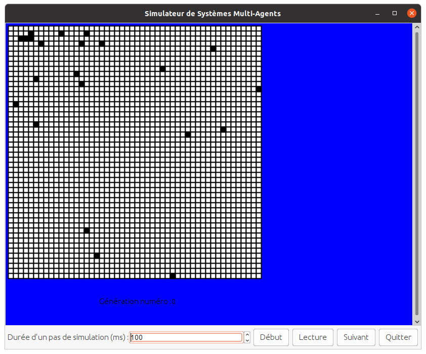
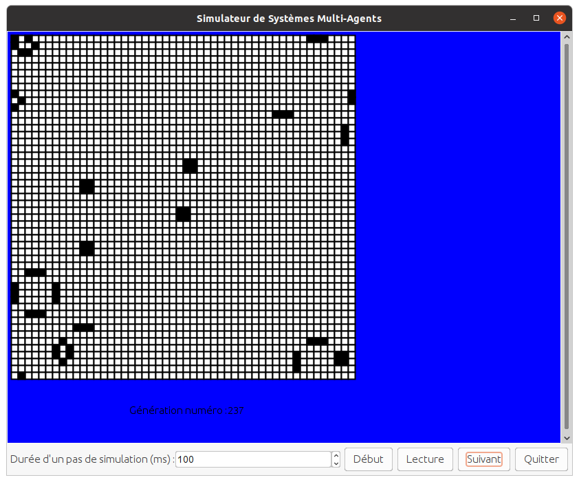

## Présentation générale du projet

*todo*

## Première Partie: jouons à la baballe

*todo*

## Deuxième Partie: Faisons des automates cellulaires

### Structure du problème 

Le but de cette partie est de représenté et de faire l'affichage graphique d'automates cellulaire. Nous avons alors 3 types de fichier:  
* Les fichiers classe de type cellule, représentant une case de notre automate  
* Les fichiers classe de type GrilleCellule, implémentant la simulation et les méthodes qui en découlent  
* Les fichiers de tests pour chaque automate    

Pour les deux premiers fichiers, il y en a de deux types. les fichiers "généraux" qui vont être des classes mères pour les classes "spécifiques" qui contribuent à un seul automate.

### Description des fichiers généraux 

Pour le type général d'une Cellule, nous avons choisi d'attribuet à l'objet ses coordonées dans la grille, l'état dans lequel elle se trouve mais aussi le nombre d'état dans lequel elle peut se trouver. Toutes les autres cellules vont donc hérité de ces attributs. Elle contient également tous les getter et setter de ces attributs qui vont être réutilisé partout. 
  
Pour le type général de Grille, celle-ci est composé de la dimension de la fenêtre ainsi que la fenêtre en elle même. Elle possède également un tableau de couleur qui va être utile lors du coloriage de la grille et qui va nous servir pour les deux dernières simulations. Un tableau représentant la grille en elle même est également présente. Ce tableau va être initialisé en fonction de la taille de la grille dans le constructeur. Pour plus d'intéractivité et de lisibilté, nous avons rajouter un attribut de comptant la génération courante afin de pouvoir l'afficher. Des getter et setter de ce dernier attribut ont donc été implémenter ainsi q'un moyen d'afficher à l'écran la grille lors de l'implémentation de la méthode next dans les sous-classes.  
Chaque sous-classe aura alors sa propre manière de :  
* compter les voisins d'une cellule  
* calculer l'étape suivante  
* implémenter next et restart

### Un premier exemple : le jeu de la vie

Le jeu de la vie est le seul qui possède son propre modèle de cellule : une cellue général dont on a fixer le nombre d'état possible à 2 (mort ou vivant). Elle n'apporte rien de plus.  

La grille elle contient un tableau d'initialisation contenant les coordonnées des cellules vivantes à l'origine, et qui va être conservé en mémoir tout le long de la simulation dans le cas où il y aurait un rappel à restart.  
Le principe général est donc le suivant :  
0- On initialise une nouvelle grille  
1- On parcours l'ancienne grille  
2- Pour chaque cellule, on calcule le nombre de voisin  
3- En fonction du type de cellule, on actualise la nouvelle grille

Pour tester notre modèle, nous avons plusieurs points de départ. L'exemple le plus concret se fini en état stationnaire avec des blocs clignotants aprés plus de 200 générations comme illustrés ci-dessous:

{width=250px}
{width=250px}  
Plusieurs configuration de départ ont été testé et aucun bug n'a pour l'instant était relevé.
 
### Une extension du jeu de la vie : le jeu de l'immigration

Le principe est globalement le même que précedemment. On va recréer une nouvelle grille à chaque étape en actualisant les cases qui en ont le besoin. Une première différence est sur l'initialisation. En effet, On rentre un tableau qui

## Troisième Partie: Suivons les Boids

Pour cette partie, on a tout d'abord modélisé les Boid de la manière la plus simple possible, comme les Balls. Puis on a fait en sorte qu'il puisse changer sa position, en fonction de son vecteur de vitesse.

Pour simplifier les choses, on a créer une class Vector qui nous a permis de modéliser au mieux nos Boids pour qu'ils correspondent aux caractéristiques que l'on voulait. Cela a aidé aussi pour les méthodes pour ajouter, multiplier, ou encore faire la norme de vecteurs.

## La simulation

Pour la simulation, on avait d'abord crée un Simulateur simple qui crée des Boids aléatoires et les affiche à l'écran. Puis on a décidé de faire une classe abstraite Boid qui permet d'avoir plusieurs types de Boid, si on veut par la suite ajouter des prédateurs par exemple.

## Les events

Pour la gestion des évenements, on a utiliser EventManager qui implémente Simulable et qui permet à notre BoidSimulator d'utiliser la gestion d'évenements.

## Cas limites

Un cas nous est arrivé, c'est quand un boid arrive en limite de fenêtre. On avait alors plusieurs choix: le faire "rebondir" et retourner dans le sens inverse ou le faire traverser la limite et arriver de l'autre côté de l'écran.

C'est cette seconde option que nous avons finalement implémenté.

## Conclusion

*todo*